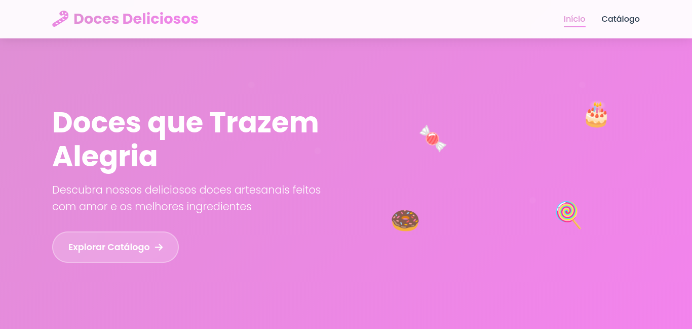
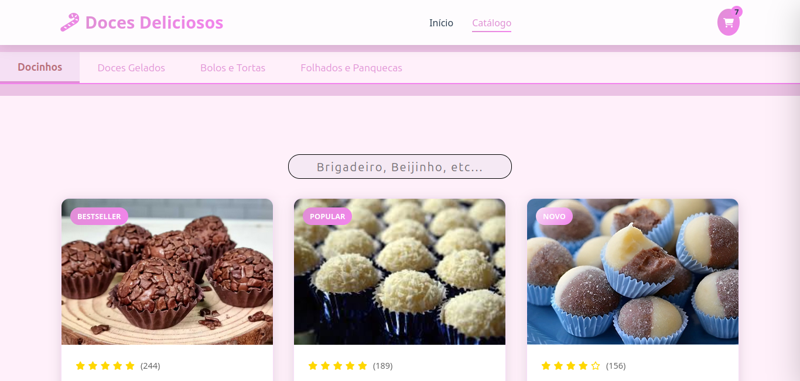

# 🍭 Doces Deliciosos

Este é o projeto Doces Deliciosos, uma doceria online onde os clientes podem explorar um catálogo de deliciosos doces artesanais e fazer pedidos diretamente pelo site.

---

## 🛠 Tecnologias utilizadas

- **HTML5**: Estrutura e marcação do conteúdo da página.

- **CSS3**: Estilo visual do site, com uso de gradientes, animações e responsividade.

- **JavaScript**: Funcionalidade interativa, como o carrinho de compras, controle de quantidades, e integração com WhatsApp para finalização de compras.

## 🚀 Funcionalidades principais

- **Página inicial**: Exibe informações sobre a doceria, categorias de doces e links para o catálogo.

- **Catálogo de produtos**: Apresenta as categorias de doces (docinhos, doces gelados, bolos, etc.) com possibilidade de adicionar ao carrinho.

- **Carrinho de compras**: Permite adicionar produtos, ajustar a quantidade, remover itens e visualizar o total.

- **Checkout**: Finaliza o pedido via WhatsApp, enviando os detalhes da compra diretamente para o número de atendimento.

- **Design responsivo**: O layout é adaptado para diferentes tamanhos de tela, oferecendo uma boa experiência tanto em desktop quanto em dispositivos móveis.

---

## 📥 Instruções de instalação e execução
### Pré-requisitos

- **Nenhum pré-requisito específico**. Basta um navegador para acessar o projeto.

### Passos para execução

1. **Abrir no navegador**:

- Para visualizar o projeto, basta abrir o arquivo index.html em um navegador de sua escolha.

2. **Configuração do carrinho de compras**:

- O carrinho de compras é salvo localmente no navegador, portanto, mesmo após fechar o navegador, as informações serão mantidas até que o usuário limpe os dados de navegação.

3. **Finalizando o pedido**:
- Ao clicar no botão de checkout, o site gera uma mensagem para o WhatsApp do cliente. A URL do WhatsApp pode ser configurada para o número de contato da sua loja.
